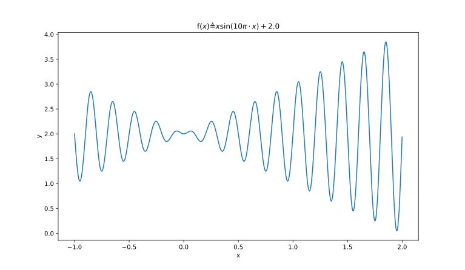

#### Project Name
**MaxFunVal**
#### Description
This project is the homework of AI course, using **Genetic Algorithm** to figure out the max or min value of function.

function description below:


domain:-1<=x<=2
#### Experiment
##### Process Figure

##### Function Figure

##### Result Figure
``` java
//blow is config params
final static int geneLength=15;
final static int iteration=30;
final static int populationSize=10;
```

Some people's data in [./doc/persons.txt](./doc/persons.txt) file, and the fitness result in [./doc/fitness.txt](./doc/fitness.txt) file
#### Reference
- [SmartDot](https://github.com/huangyebiaoke/SmartDot)
- [遗传算法求数值函数的最值](https://www.cnblogs.com/pkuimyy/p/11585310.html)
- [遗传算法实现寻找函数最值](https://blog.csdn.net/springtostring/article/details/82221318)
- [使用遗传算法求解函数最值](https://zhuanlan.zhihu.com/p/94477212)
